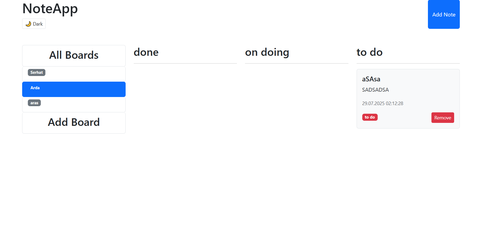
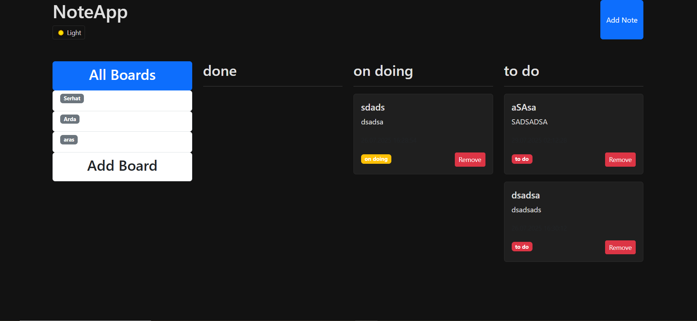

# 📝 React Note App

A simple, modern, and user-friendly note-taking application built with **React** and **Vite**. This project demonstrates core React concepts like component design, props, state management, conditional rendering, and theme handling — while offering real-world usability.

## 🚀 Live Demo

👉 [View App on Vercel](https://todo-app-iota-nine-58.vercel.app/)

---

## 📸 Screenshots

### ☀️ Light Mode



### 🌙 Dark Mode



---

## ✨ Features

- 🧩 Create and manage multiple **Boards**
- 🗂️ Add notes to each board with **status tagging** ("to do", "on doing", "done")
- 💾 Notes persist across sessions using **LocalStorage**
- 🎨 Theme toggle support (light/dark)
- ♻️ **Reusable components**: `NoteCard`, `Modal`, `Button`, etc.
- ⚡ Built using **Vite** for fast development
- 📱 Responsive design with **Bootstrap 5**

---

## 🔧 Tech Stack

- ✅ React
- ✅ Vite
- ✅ Bootstrap 5
- ✅ Tailwind CSS (optional, utility classes)
- ✅ JavaScript (ES6+)
- ✅ HTML + CSS

---

## 🚀 Getting Started

```bash
# 1. Clone the repository
git clone https://github.com/balpi/note-app.git

# 2. Navigate to project directory
cd note-app

# 3. Install dependencies
npm install

# 4. Start the development server
npm run dev
```

## 📄 License

This project is licensed under the MIT License - see the [LICENSE](LICENSE) file for details.
